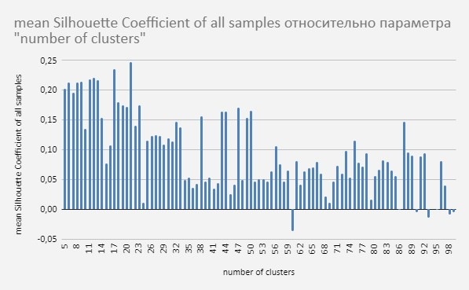

# Проект рекомендательной системы для аптечной сети

- [Описание сервиса](#описание-сервиса)
- [Структура проекта](#структура-проекта)
- [Установка и настройка](#установка-и-настройка)
- [Порядок запуска скриптов](#порядок-запуска-скриптов)
- [Требования к данным](#требования-к-данным)
- [Требования к окружению](#требования-к-окружению)
- [Построение модели коллаборативной фильтрации](#построение-модели-коллаборативной-фильтрации-ml-collaborative-filtering)
- [Построение модели Word2Vec](#построение-модели-word2vec)
- [Построение модели кластеризации](#построение-модели-кластеризации-к-means)
    - [Подбор количества классов](#подбор-количества-классов)
- [Выдача рекомендаций](#выдача-рекомендаций)

## Описание сервиса

Сервис получает данные о покупках клиента, анализирует их с помощью модели машинного обучения и отправляет сотруднику на кассе перечень рекомендуемых товаров. В него входят топ-3 товаров, которые клиент с высокой вероятностью добавит к своим покупкам. Сервис предлагает конкретные товарные позиции с точностью до артикула (SKU).

В сервисе предусмотрено два вида рекомендаций, на основе выявления похожих покупателей со схожими предпочтениями, а также рекомендации товаров, которые часто покупают совместно.

Автоматизированный ML-инструмент помогает, с одной стороны, выявлять скрытые потребности клиентов, а с другой — предоставлять им полезные и достаточно точные рекомендации по индивидуальному списку приобретенных медикаментов. Задача данного решения - увеличение среднего чека за счёт адресных, нужных покупателю, предложений.

## Структура проекта
```
.
├── README.md                      # Документация проекта
├── requirements.txt               # Зависимости проекта
├── LICENSE                        # MIT лицензия
├── .gitignore                     # Правила игнорирования файлов Git
├── scripts/                       # Скрипты проекта
│   ├── data_processing.py         # Предобработка данных
│   ├── predict_all.py             # Общий скрипт предсказаний
│   ├── model_als/                 # Модель коллаборативной фильтрации
│   │   ├── train.py               # Обучение ALS модели
│   │   └── predict.py             # Предсказания ALS модели
│   ├── model_word2vec/            # Word2Vec модель
│   │   ├── train.py               # Обучение Word2Vec модели
│   │   └── predict.py             # Предсказания Word2Vec модели
│   └── model_kmeans/              # Кластеризация товаров
│       ├── train.py               # Обучение K-means модели
│       ├── predict.py             # Предсказания K-means модели
│       └── clusters_2levels.py    # Двухуровневая кластеризация
├── data/                          # Директория данных (игнорируется git)
│   ├── sales.csv                  # Данные о продажах
│   └── products.csv               # Информация о товарах
├── models/                        # Директория моделей (игнорируется git)
│   ├── als_model_2024_12_15.model # Модель ALS
│   ├── word2vec_model_2024_12_15  # Модель Word2Vec
│   ├── kmeans_2024_12_15          # Параметры K-means
│   └── kmeans_model_2024_12_15    # Модель K-means
└── images/                        # Изображения для документации
```

## Установка и настройка

1. Клонировать репозиторий:
```bash
git clone https://github.com/muzykantov/pharmacy-recsys.git
cd pharmacy-recsys
```

2. Создать виртуальное окружение и активировать его:
```bash
python -m venv venv
source venv/bin/activate  # Linux/Mac
# или
venv\Scripts\activate    # Windows
```

3. Установить зависимости:
```bash
pip install -r requirements.txt
```

4. Создать необходимые директории:
```bash
mkdir -p data models
```

5. Поместить файлы данных в директорию `data/`:
- `sales.csv` - данные о продажах
- `products.csv` - информация о товарах

## Порядок запуска скриптов

1. Предварительная обработка данных:
```bash
python scripts/data_processing.py
```
Скрипт выполняет:
- Загрузку и проверку структуры данных
- Преобразование типов данных
- Фильтрацию некорректных значений
- Сохранение очищенных данных

2. Обучение моделей:
```bash
# Обучение ALS модели
python scripts/model_als/train.py

# Обучение Word2Vec модели
python scripts/model_word2vec/train.py

# Обучение K-means модели
python scripts/model_kmeans/train.py
```

3. Получение предсказаний:
```bash
# Предсказания с помощью ALS
python scripts/model_als/predict.py

# Предсказания с помощью Word2Vec
python scripts/model_word2vec/predict.py

# Предсказания с помощью K-means
python scripts/model_kmeans/predict.py

# Двухуровневая кластеризация
python scripts/model_kmeans/clusters_2levels.py

# Общие предсказания всеми моделями
python scripts/predict_all.py
```

## Требования к данным

Для работы скриптов необходимы следующие файлы в директории `data/`:
- `sales.csv` - данные о продажах
- `products.csv` - информация о товарах

## Требования к окружению

- Python 3.x
- PySpark 3.x
- pandas
- numpy

Модели сохраняются в директории `models/`:
- `als_model_2024_12_15.model` - модель коллаборативной фильтрации
- `word2vec_model_2024_12_15` - модель Word2Vec
- `kmeans_2024_12_15` - параметры K-means модели
- `kmeans_model_2024_12_15` - обученная K-means модель

## Исследовательский анализ на spark

Все данные о продажах хранятся в виде `.csv` файлов в директории `data/`

```python
from pyspark.sql import SparkSession
from pyspark.sql import functions as F
from pyspark.sql.types import DateType, StructType, StringType, StructField, IntegerType, DoubleType
from pyspark.ml.feature import Word2Vec, Word2VecModel
from pyspark.ml.recommendation import ALS
from pyspark.ml.clustering import KMeans, KMeansModel
from pyspark.ml.evaluation import RegressionEvaluator, ClusteringEvaluator
from pyspark.mllib.evaluation import RankingMetrics
import time

spark = SparkSession.builder.appName("PharmacyRecsys").getOrCreate()
spark.sparkContext.setLogLevel("ERROR")
```

#### Общий обзор данных о продажах

```python
data = spark.read.csv("data/sales.csv", header=True, inferSchema=True)
data.printSchema()
```

```shell
root
 |-- sale_date_date: timestamp (nullable = true)
 |-- contact_id: integer (nullable = true)
 |-- shop_id: integer (nullable = true)
 |-- product_id: integer (nullable = true)
 |-- product_sub_category_id: integer (nullable = true)
 |-- product_category_id: integer (nullable = true)
 |-- brand_id: integer (nullable = true)
 |-- quantity: double (nullable = true)
 |-- __index_level_0__: long (nullable = true)
```

```python
data.show(n=5, truncate=False)
print('Count rows of dataset: {}'.format(data.count()))
```

```shell
+-------------------+----------+-------+----------+-----------------------+-------------------+--------+--------+-----------------+
|sale_date_date     |contact_id|shop_id|product_id|product_sub_category_id|product_category_id|brand_id|quantity|__index_level_0__|
+-------------------+----------+-------+----------+-----------------------+-------------------+--------+--------+-----------------+
|2018-12-07 00:00:00|1260627   |1455   |168308    |906                    |205                |-1      |1.0     |0                |
|2018-12-07 00:00:00|198287    |279    |134832    |404                    |93                 |-1      |1.0     |1                |
|2018-12-07 00:00:00|2418385   |848    |101384    |404                    |93                 |-1      |1.0     |2                |
|2018-12-07 00:00:00|1285774   |1511   |168570    |906                    |205                |-1      |1.0     |3                |
|2018-12-07 00:00:00|1810323   |1501   |168319    |906                    |205                |-1      |1.0     |4                |
+-------------------+----------+-------+----------+-----------------------+-------------------+--------+--------+-----------------+

Count rows of dataset: 19346684
```

#### Число уникальных значений в каждой колонке

```python
data.select([F.countDistinct(col).alias(col) for col in data.columns]).show()
```

```shell
+--------------+----------+-------+----------+-----+-----------------------+-------------------+--------+--------+
|sale_date_date|contact_id|shop_id|product_id| name|product_sub_category_id|product_category_id|brand_id|quantity|
+--------------+----------+-------+----------+-----+-----------------------+-------------------+--------+--------+
|           214|   1642379|    851|     36549|36113|                    440|                145|    1617|    1296|
+--------------+----------+-------+----------+-----+-----------------------+-------------------+--------+--------+
```

## Построение модели коллаборативной фильтрации (ml-collaborative-filtering)

### Подготовка

#### Загружаем данные о продажах в spark dataframe. Отберем только необходимые колонки, а также создадим дополнительный столбец с номером недели в году для последующего разбиения

```python
# Загружаем данные
data = spark.read.csv("data/sales.csv", header=True, inferSchema=True)
data = data \
    .select('sale_date_date', 'contact_id', 'product_id', 'quantity') \
    .withColumn('quantity', F.when(F.col("quantity") != 1, 1).otherwise(F.col("quantity"))) \
    .withColumnRenamed(existing='product_id', new='item_id') \
    .withColumnRenamed(existing='contact_id', new='user_id') \
    .withColumn('week_of_year', F.weekofyear(F.col('sale_date_date')))
data.show(n=5)
```

```shell
+-------------------+-------+-------+--------+------------+
|     sale_date_date|user_id|item_id|quantity|week_of_year|
+-------------------+-------+-------+--------+------------+
|2018-12-07 00:00:00|1260627| 168308|     1.0|          49|
|2018-12-07 00:00:00| 198287| 134832|     1.0|          49|
|2018-12-07 00:00:00|2418385| 101384|     1.0|          49|
|2018-12-07 00:00:00|1285774| 168570|     1.0|          49|
|2018-12-07 00:00:00|1810323| 168319|     1.0|          49|
+-------------------+-------+-------+--------+------------+
```

#### Отберем только 15 последних недель для обучения, из-за ограниченности вычислительной мощности

```python
def sample_by_week(df, week_col_name, split_size_weeks):
    threshold_week = int(data.select(F.max(week_col_name)).collect()[0][0]) - split_size_weeks
    df_before = df.filter(F.col(week_col_name) < threshold_week)
    df_after = df.filter(F.col(week_col_name) >= threshold_week)
    return df_before, df_after

before, data = sample_by_week(df=data, week_col_name='week_of_year', split_size_weeks=15)
data.orderBy('sale_date_date', ascending=True).show(n=3)
```

```shell
+-------------------+-------+-------+--------+------------+
|     sale_date_date|user_id|item_id|quantity|week_of_year|
+-------------------+-------+-------+--------+------------+
|2018-11-08 00:00:00|2591126|  32087|     1.0|          45|
|2018-11-08 00:00:00|2542992|  97117|     1.0|          45|
|2018-11-08 00:00:00|2477043| 106860|     1.0|          45|
+-------------------+-------+-------+--------+------------+
```

#### Просмотрим статистические данные по выборке

```python
def basic_statistics_of_data():
    numerator = data.select("quantity").count()
    num_users, num_items = data.select("user_id").distinct().count(), data.select("item_id").distinct().count()
    denominator = num_users * num_items
    sparsity = (1.0 - (numerator * 1.0) / denominator) * 100
    return spark.createDataFrame(data=[('total number of rows', str('{0:,}'.format(numerator).replace(',', '\''))),
                                     ('number of users', str('{0:,}'.format(num_users).replace(',', '\''))),
                                     ('number of items', str('{0:,}'.format(num_items).replace(',', '\''))),
                                     ('sparsity', str(sparsity)[:5] + "% empty")],
                               schema=['statistic', 'value'])

basic_statistics_of_data().show(truncate=False)
```

```shell
+--------------------+------------+
|statistic           |value       |
+--------------------+------------+
|total number of rows|4'603'016   |
|number of users     |854'281     |
|number of items     |22'921      |
|sparsity            |99.97% empty|
+--------------------+------------+
```

#### Сделаем случайное разбиение на тестовую и обучающую выборки. Для теста возьмем 10%, т.к данных достаточно много

```python
(train, test) = data.randomSplit(weights=[0.9, 0.1], seed=3)
```

### Обучение модели

```python
als = ALS(userCol="user_id", itemCol="item_id", ratingCol="quantity",
          nonnegative=True, implicitPrefs=True, coldStartStrategy="drop")
evaluator = RegressionEvaluator(metricName="rmse", labelCol="quantity", predictionCol="prediction")

start = time.time()
model_als = als.fit(train)
print('time = ' + str(time.time() - start))
```

```shell
time = 52.6529769897
```

```python
# Сохраняем модель
model_als.save("models/als_model_2024_12_15.model")
```

#### Параметры модели ALS

```python
spark.createDataFrame(
    data=[('Rank', str(model.rank)), ('MaxIter', str(als.getMaxIter())), ('RegParam', str(als.getRegParam()))],
    schema=['parameter', 'value']).show()
```

```shell
+---------+-----+
|parameter|value|
+---------+-----+
|     Rank|   10|
|  MaxIter|   10|
| RegParam|  0.1|
+---------+-----+
```

#### Сделаем прогноз на тестовой выборке

```python
test_predictions = model_als.transform(test)
test_predictions.show(n=5)
```

```shell
+-------------------+-------+-------+--------+------------+------------+
|     sale_date_date|user_id|item_id|quantity|week_of_year|  prediction|
+-------------------+-------+-------+--------+------------+------------+
|2018-11-16 00:00:00| 396523|   8086|     1.0|          46| 0.003291605|
|2018-11-11 00:00:00|1642159|   8086|     1.0|          45|0.0030388434|
|2018-11-17 00:00:00|2025608|   8086|     1.0|          46| 3.899849E-5|
|2018-11-24 00:00:00|1200425|   8086|     1.0|          47|1.8746716E-4|
|2018-11-15 00:00:00|1996289|   8086|     1.0|          46| 0.002490461|
+-------------------+-------+-------+--------+------------+------------+
```

### Метрики качества

#### Создадим результирующую таблицу с реальными и предсказанными товарами для оценки качества

```python
train_actual_items = train \
    .select('user_id', 'item_id') \
    .groupBy('user_id').agg(F.collect_list(col='item_id')) \
    .withColumnRenamed(existing='collect_list(item_id)', new='actual')

train_recs_items = model.recommendForAllUsers(numItems=5) \
    .select('user_id', F.col("recommendations.item_id").alias('recs_ALS'))

result = train_actual_items.join(other=train_recs_items, on='user_id', how='inner')
result.show(n=5, truncate=True)
```

```shell
+-------+--------------------+--------------------+
|user_id|              actual|            recs_ALS|
+-------+--------------------+--------------------+
|    463|     [102659, 66900]|[61115, 138005, 1...|
|    471|[51466, 28784, 28...|[162780, 135427, ...|
|   1238|     [59334, 102788]|[41096, 102788, 4...|
|   1342|     [97772, 110565]|[110629, 156491, ...|
|   1580|     [60809, 153583]|[138005, 61115, 1...|
+-------+--------------------+--------------------+
```

#### Выведем метрики оценки качества модели

```python
RMSE = evaluator.evaluate(test_predictions)
metrics = RankingMetrics(predictionAndLabels=result.select('actual', 'recs_ALS').rdd.map(tuple))
metrics_df = spark.createDataFrame(data=[('RMSE', RMSE),
                                       ('precision@k', metrics.precisionAt(5)),
                                       ('ndcg@k', metrics.ndcgAt(5)),
                                       ('meanAVGPrecision', metrics.meanAveragePrecision)],
                                 schema=['metric', 'value'])
metrics_df.withColumn('value', F.round('value', 5)).show(truncate=False)
```

```shell
+----------------+-------+
|metric          |value  |
+----------------+-------+
|RMSE            |0.98132|
|precision@k     |0.06178|
|ndcg@k          |0.06803|
|meanAVGPrecision|0.04082|
+----------------+-------+
```

## Построение модели Word2Vec

### Подготовка данных

#### Необходимо преобразовать `contact_id` в StringType, а `sale_date_date` в DateType

```python
data = spark.read.csv("data/sales.csv", header=True, inferSchema=True)
data = data \
    .select('sale_date_date', 'contact_id', 'shop_id', 'product_id', 'quantity') \
    .withColumn(colName="sale_date_date", col=data["sale_date_date"].cast(DateType())) \
    .withColumn(colName="product_id", col=data["product_id"].cast(StringType()))
data.show(n=5, truncate=True)
```

```shell
+--------------+----------+-------+----------+--------+
|sale_date_date|contact_id|shop_id|product_id|quantity|
+--------------+----------+-------+----------+--------+
|    2018-12-07|   1260627|   1455|    168308|     1.0|
|    2018-12-07|    198287|    279|    134832|     1.0|
|    2018-12-07|   2418385|    848|    101384|     1.0|
|    2018-12-07|   1285774|   1511|    168570|     1.0|
|    2018-12-07|   1810323|   1501|    168319|     1.0|
+--------------+----------+-------+----------+--------+
```

##### Просмотрим количество уникальных пользователей в нашем наборе данных

```python
users = data.select('contact_id').distinct()
print('Number of unique users = ' + str('{0:,}'.format(users.count()).replace(',', '\'')))
```

```shell
Number of unique users = 1'636'831
```

#### Сделаем разбиение на тестовую и обучающую выборки. Разбиение будем делать по клиентам

Для теста возьмем 10% клиентов и сформируем выборки на основе принадлежности клиента к тесту или трейну

```python
(users_train, users_valid) = users.randomSplit(weights=[0.9, 0.1], seed=5)
```

```shell
num_train_users = 1473217
num_test_users = 163614
```

```python
train_df = data.join(other=users_train, on='contact_id', how='inner')
validation_df = data.join(other=users_valid, on='contact_id', how='inner')

print('train_df.count = {}\nvalidation_df.count = {}'.format(train_df.count(), validation_df.count()))
```

```shell
train_df.count = 17398192
validation_df.count = 1948492
```

#### Введем колонку, определяющую номер чека и уберем лишние

```python
def create_col_orders(df):
    return df \
        .select(F.concat_ws('_', data.sale_date_date, data.shop_id, data.contact_id).alias('order_id'),
                'product_id', 'quantity') \
        .groupBy('order_id') \
        .agg(F.collect_list(col='product_id')) \
        .withColumnRenamed(existing='collect_list(product_id)', new='actual_products')

train_orders = create_col_orders(df=train_df)
validation_orders = create_col_orders(df=validation_df)

train_orders.show(n=5)
```

```shell
+--------------------+--------------------+
|            order_id|     actual_products|
+--------------------+--------------------+
|2018-01-01 00:00:...|     [77808, 130823]|
|2018-01-01 00:00:...|     [60367, 125733]|
|2018-01-01 00:00:...|    [110629, 138956]|
|2018-01-01 00:00:...|[217227, 136540, ...|
|2018-01-01 00:00:...|[70951, 94613, 23...|
+--------------------+--------------------+
```

### Обучение модели

```python
word2Vec = Word2Vec(vectorSize=100, minCount=5, numPartitions=1, seed=33, windowSize=3,
                    inputCol='actual_products', outputCol='result')
start = time.time()
model = word2Vec.fit(dataset=train_orders)
print('time = ' + str(time.time() - start))
```

#### Сохранение модели

```python
model.save("models/word2vec_model_2024_12_15")
```

Проверим, что модель сохранена успешно

```python
loadedModel = Word2VecModel.load("models/word2vec_model_2024_12_15")
print('Good saving? -> ' + str(loadedModel.getVectors().first().word == model.getVectors().first().word))
```

```shell
Good saving? -> True
```

### Метрики

К сожалению для данной модели без онлайн потока данных о реальных продажах изменить качество не представляется возможным.

## Построение модели кластеризации (К-means)

#### Загружаем данные о продажах в spark dataframe. Отберем только необходимые колонки

```python
# Загружаем сохраненные модели
w2v_model = Word2VecModel.load("models/word2vec_model_2024_12_15")
product_vectors = w2v_model.getVectors().withColumnRenamed(existing='word', new='product_id')

# Загружаем данные о продуктах
products = spark.read.csv("data/products.csv", header=True, inferSchema=True) \
    .withColumn('name', F.regexp_replace('name', r'(\(\d+\) )', ''))

product_vectors.show(n=5)
```

```shell
+----------+--------------------+
|product_id|              vector|
+----------+--------------------+
|    144322|[-0.0024441950954...|
|     58451|[-3.9240214391611...|
|     75120|[-0.0589764676988...|
|    153532|[-0.0256759468466...|
|    134530|[-0.0764870494604...|
+----------+--------------------+
```

```python
products.show(n=5, truncate=False)
```

```shell
+----------+----------------------------------------------------------+
|product_id|name                                                      |
+----------+----------------------------------------------------------+
|104124    |Раствор Ликосол-2000 для конт.линз фл 240мл 817           |
|92248     |Риностоп спрей наз. 0,05% фл. 15мл 701                    |
|350363    |Кларитросин табл.п.п.о. 500мг №10 403                     |
|129004    |Флуконазол-Тева капс. 150мг №1 622                        |
|125915    |Валсартан-Гидрохлоротиазид таб. п.п.о. 80мг+12,5мг №28 738|
+----------+----------------------------------------------------------+
```

### Подбор количества классов

Подбор осуществляется по максимальному значению коэффициента `silhouette`.

Коэффициент «силуэт» вычисляется с помощью среднего внутрикластерного расстояния (a) и среднего расстояния до ближайшего кластера (b) по каждому образцу. Силуэт вычисляется как (b - a) / max(a, b). Поясню: b — это расстояние между a и ближайшим кластером, в который a не входит. Можно вычислить среднее значение силуэта по всем образцам и использовать его как метрику для оценки количества кластеров.

Для вычисления используем функцию, в которую передаем список чисел кластеров

```python
def get_silhouette_scores(vectors_df, features_col, clusters_list):
    start = time.time()
    evaluator = ClusteringEvaluator(predictionCol="prediction", featuresCol='vector', metricName='silhouette')
    silhouette_scores_dict = dict()
    for i in clusters_list:
        KMeans_algo = KMeans(featuresCol=features_col, k=i, maxIter=20, seed=3)
        KMeans_fit = KMeans_algo.fit(vectors_df)
        output = KMeans_fit.transform(vectors_df)
        score = evaluator.evaluate(output)
        print('i: {}, score: {}, time: {}'.format(i, score, str(time.time() - start)))
        silhouette_scores_dict[i] = score
    scores_df = spark.createDataFrame(data=list(map(list, silhouette_scores_dict.items())),
                                    schema=["n_clusters", "score"])
    return scores_df
```

Подбор сделаем для чисел кластеров от 5 до 100

```python
scores_df = get_silhouette_scores(clusters_list=range(5, 100, 1), vectors_df=product_vectors, features_col='vector')
scores_df \
    .orderBy('score', ascending=False) \
    .show(n=5)
```

```shell
+----------+-------------------+
|n_clusters|              score|
+----------+-------------------+
|        21|0.24705539575632268|
|        17|0.23530894861309629|
|        12|0.22083229042257424|
|        11|0.21774700055303492|
|        13|0.21705090230733062|
+----------+-------------------+
```



### Обучение конечной модели

По значению метрики наилучшее разбиение получается на 21 класс

```python
best_k = 21

kmeans_best_params = KMeans(featuresCol='vector', k=best_k, maxIter=20, seed=3)
kmeans_model = kmeans_best_params.fit(product_vectors)
```

#### Сохранение модели

```python
kmeans_best_params.save("models/kmeans_2024_12_15")
kmeans_model.save("models/kmeans_model_2024_12_15")
```

```shell
393     786     models/kmeans_2024_12_15
18.6 K  37.1 K  models/kmeans_model_2024_12_15
7.5 M   15.0 M  models/word2vec_model_2024_12_15
```

## Выдача рекомендаций

### Создаем классы для разного вида рекомендаций

```python
class ModelALS:
    def __init__(self):
        self.model = None
    
    def load_model(self, model_path):
        """ Загрузка модели """
        self.model = ALSModel.load(model_path)
    
    def predict_to_dict(self, user_id, n_recs=5):
        start = time.time()
        preds_dict = {}
        recs_df = self.model \
            .recommendForAllUsers(numItems=n_recs) \
            .where(condition=F.col('user_id') == user_id) \
            .withColumn(colName="rec_exp", col=F.explode("recommendations")) \
            .select(F.col("rec_exp.item_id"))
        preds_dict['user_id'] = user_id
        preds_dict['recommendations'] = [int(row.item_id) for row in recs_df.collect()]
        preds_dict['prediction time'] = round(number=time.time() - start, ndigits=3)
        return preds_dict


class ModelWord2Vec:
    def __init__(self):
        self.model = None
    
    def load_model(self, model_path):
        """ Загрузка модели """
        self.model = Word2VecModel.load(model_path)
    
    def predict_to_dict(self, product_id, n_recs=5):
        """ Выдача предсказаний в виде словаря """
        start = time.time()
        preds_dict = {}
        recs_df = self.model \
            .findSynonyms(word=str(product_id), num=n_recs) \
            .withColumnRenamed(existing='word', new='product_id') \
            .orderBy('similarity', ascending=False)
        preds_dict['product_id'] = product_id
        preds_dict['recommendations'] = [int(row.product_id) for row in recs_df.collect()]
        preds_dict['prediction time'] = round(number=time.time() - start, ndigits=3)
        return preds_dict
    
    def get_name_product_id(self, products_df, product_id):
        name = products_df.where(condition=F.col('product_id') == product_id).select('name').collect()[0]['name']
        return name
    
    def predict_to_df(self, products_df, product_id, num_recs=5):
        return self.model \
            .findSynonyms(word=str(product_id), num=num_recs) \
            .withColumnRenamed(existing='word', new='product_id') \
            .join(other=products_df, on='product_id', how='inner') \
            .orderBy('similarity', ascending=False).withColumn('similarity', F.round('similarity', 6)) \
            .select('product_id', 'name')
```

### Выполняем рекомендации

### Предсказания

```python
model_als = ModelALS()
model_als.load_model("models/als_model_2024_12_15.model")

model_w2v = ModelWord2Vec()
model_w2v.load_model("models/word2vec_model_2024_12_15")
```

#### Сделаем предсказание 3 товаров для покупателя `contact_id=471`

```python
predict_als = model_als.predict_to_dict(user_id=471, n_recs=3)
pprint(predict_als)
```

```shell
{'user_id': 471, 
 'prediction time': 154.332, 
 'recommendations': [162780, 135427, 46797]}
```

#### Сделаем предсказание для товара `product_id=33569`

```python
product_name = model_w2v.get_name_product_id(products_df=products, product_id=33569)
print(product_name)
```

```shell
Диротон таб.20мг №28 738
```

```python
predict_w2v = model_w2v.predict_to_dict(product_id=33569, n_recs=3)
pprint(predict_w2v)
```

```shell
{'prediction time': 0.198,
 'product_id': 33569,
 'recommendations': [52119, 60972, 137421]}
```

```python
predict_w2v_df = model_w2v.predict_to_df(products_df=products, product_id=33569, num_recs=3)
predict_w2v_df.show(truncate=False)
```

```shell
+----------+---------------------------------------------------------+
|product_id|name                                                     |
+----------+---------------------------------------------------------+
|52119     |Метопролол ретард-Акрихин таб.пролонг.п.п.о.100мг №30 738|
|60972     |Амлодипин тб 10мг N20 738                                |
|137421    |Пектрол табл. 40 мг. №30 738                             |
+----------+---------------------------------------------------------+
```

### Кластеризация

```python
w2v_model = Word2VecModel.load("models/word2vec_model_2024_12_15")
kmeans_best_params = KMeans.load("models/kmeans_2024_12_15")
kmeans_model = KMeansModel.load("models/kmeans_model_2024_12_15")

product_vectors = w2v_model.getVectors().withColumnRenamed(existing='word', new='product_id')
```

#### Просмотрим содержание кластера №10

```python
predictions = kmeans_model.transform(product_vectors)

def show_products_of_one_cluster(num_cluster, n_rows, with_sort=True):
    print('\nNumber of current cluster = ' + str(num_cluster))
    predictions_filtered = predictions \
        .where(condition=F.col('prediction') == num_cluster) \
        .select('product_id') \
        .join(other=products, on='product_id', how='left')
    predictions_filtered = predictions_filtered.orderBy('name', ascending=True) if with_sort else predictions_filtered
    return predictions_filtered.show(n=n_rows, truncate=False)

show_products_of_one_cluster(num_cluster=10, n_rows=10, with_sort=True)
```

```shell
Number of current cluster = 10
+----------+----------------------------------------------------------------+
|product_id|name                                                            |
+----------+----------------------------------------------------------------+
|115298    |Аир [корневища 1,5г фильтр-пакет уп] N20 КЛС 617                |
|112056    |Аир [корневища пачка 75г] N1 КЛС 617                            |
|142245    |Алтей [корень коробка 75г] N1 КЛС 617                           |
|107187    |Анис [плоды] 50г N1 617                                         |
|55079     |Багульник [болотного побеги пачка 50г] N1 КЛС 617               |
|35217     |Береза [лист пачка 50г] N1 617                                  |
|64809     |Береза [лист фильтр-пакет 1,5г] N20 КЛС 617                     |
+----------+----------------------------------------------------------------+
```